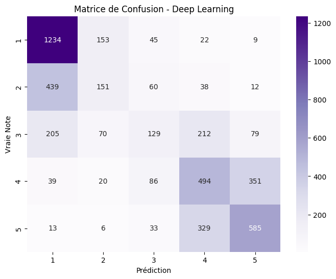
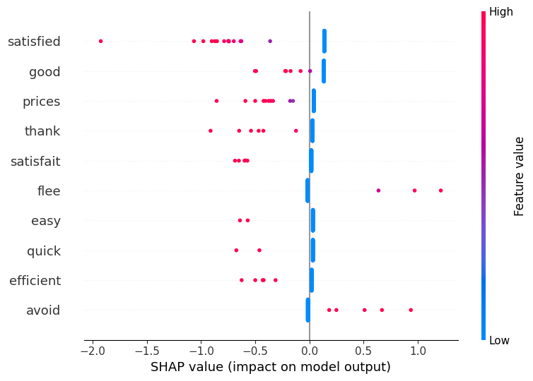

# Insurance Reviews NLP

Predicting star ratings, finding topics and answering questions on **~24,000 French insurance customer reviews**, with a Streamlit dashboard powered by Hugging Face models and **Llama 3 running locally**.

School project (NLP course, ESILV, March 2026), made by two students.


## What it does

**Notebook** ([`notebooks/insurance_reviews_nlp.ipynb`](notebooks/insurance_reviews_nlp.ipynb)):

1. **Cleaning and translation**: regex cleaning, French spelling correction (`pyspellchecker` with a word cache), then translation of every review to English (`deep-translator`, 15 threads), so English pre-trained models can be used.
2. **Exploration**: rating distribution, most reviewed insurers, word cloud.
3. **Baseline**: TF-IDF + logistic regression, explained with **SHAP**.
4. **Topic modeling**: LDA with 5 topics.
5. **Deep learning**: `paraphrase-multilingual-MiniLM-L12-v2` sentence embeddings + a small PyTorch classifier (2 hidden layers, dropout).
6. **Error analysis** of the worst predictions (3 stars or more off).
7. **Word2Vec** trained on the corpus, **semantic search** with cosine similarity, and an export for the TensorFlow Embedding Projector.

**Streamlit app** ([`app/app.py`](app/app.py)), 4 pages:

| Page | How it works |
|---|---|
| Global dashboard | Dataset statistics |
| Prediction | Star rating with multilingual BERT (`nlptown/bert-base-multilingual-uncased-sentiment`) + main subject (Pricing, Coverage, Claims…) with zero-shot `facebook/bart-large-mnli` |
| Summary by insurer | Llama 3 summarises the insurer's reviews in two sentences |
| RAG & QA | The question is embedded with MiniLM, the 5 closest English reviews are retrieved by cosine similarity, and Llama 3 answers only from them (sources shown) |

[`app/app_lite.py`](app/app_lite.py) is the same app without Ollama: BART-XSum for summaries and Flan-T5 for answers. We kept Llama 3 for the main app because Flan-T5 hallucinated more in our tests.

## Results

Rating prediction (1 to 5 stars), test set of 4,814 reviews:

| Model | Accuracy | Macro F1 |
|---|---|---|
| TF-IDF + logistic regression | 0.52 | 0.43 |
| MiniLM embeddings + neural network | **0.54** | **0.46** |

- The embedding model is only slightly better than the baseline.
- Most errors are off by one star: **89 %** of predictions are within ±1 star of the true rating (computed from the confusion matrix below).
- 2- and 3-star reviews are the hardest (F1 around 0.25): customers often describe a bad event but a correct service, or the opposite.

<p align="center">
  
  
</p>

On the right, SHAP for the 1-star class of the baseline: *satisfied*, *good* and *thank* push away from 1 star; *avoid* and *flee* push towards it. *Flee* is a translation of the French *à fuir* ("stay away").

## Project structure

```
├── notebooks/
│   └── insurance_reviews_nlp.ipynb   # full analysis, with the outputs of the original run
├── app/
│   ├── app.py                        # Streamlit app (Hugging Face + Llama 3 via Ollama)
│   ├── app_lite.py                   # same app, Hugging Face models only
│   └── common.py                     # data loading, English filter, shared pages
├── data/
│   ├── raw/                          # course dataset (not included)
│   └── processed/                    # created by the notebook (not included)
├── docs/images/                      # figures used in this README
└── requirements.txt
```

## Run it

```bash
git clone https://github.com/Oradixx/insurance-reviews-nlp.git
cd insurance-reviews-nlp
python -m venv .venv && source .venv/bin/activate
pip install -r requirements.txt
```

1. **Data**: the dataset was provided by the course and is not redistributed here (see [`data/README.md`](data/README.md)). Put the `avis_*_traduit*.xlsx` files in `data/raw/`.
2. **Notebook**: run `notebooks/insurance_reviews_nlp.ipynb`. It writes `reviews_clean.csv` and `review_embeddings.pkl` to `data/processed/`. A GPU is recommended: we used a Colab T4. On Colab, set `DATA_DIR` in the first cell.
3. **App**:
   ```bash
   # main app: needs Ollama (https://ollama.com)
   ollama pull llama3
   streamlit run app/app.py

   # or without Ollama
   streamlit run app/app_lite.py
   ```

## Limitations

- **Translation quality**: some reviews stayed in French or mixed languages (translation errors fall back to the original text). One LDA topic is made of French stop words. The app filters those reviews out with a simple word-based check (`is_valid_english`).
- **Spelling correction is not used downstream**: the translation step takes the original review (`avis`), not the corrected one (`avis_cor`), so `avis_cor_en` is a translation of the raw text.
- **Single train/test split** and no hyperparameter search; the neural network runs for 10 epochs.
- **"Keywords" in the app** are a simple heuristic (longer words of the review), not a model explanation; the SHAP analysis is in the notebook.
- The app's star prediction uses a pre-trained multilingual BERT, not the classifier trained in the notebook.

## Authors

- **Clément Vurpillot** — [@Oradixx](https://github.com/Oradixx)
- **Noé Spychala**

Project from the NLP course at ESILV (Data & AI major).
